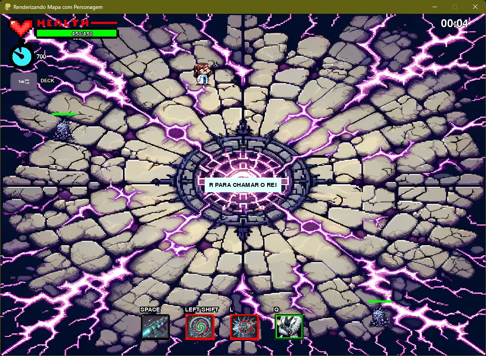
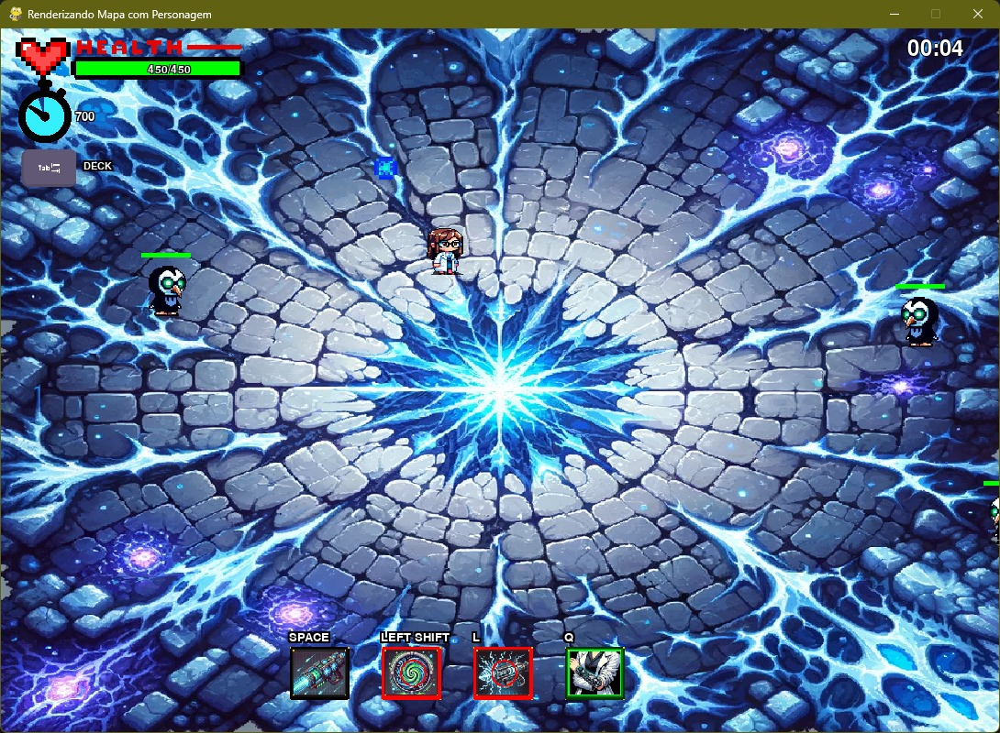
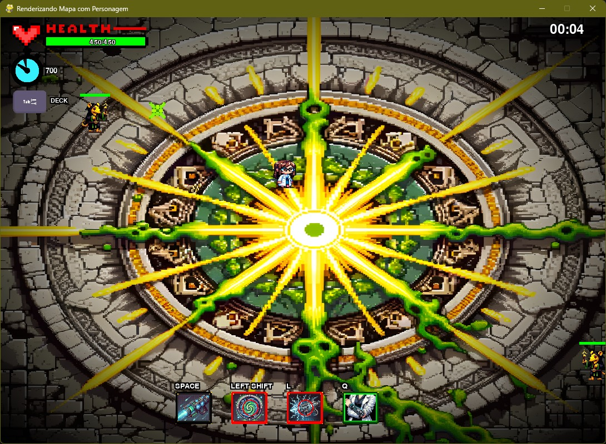
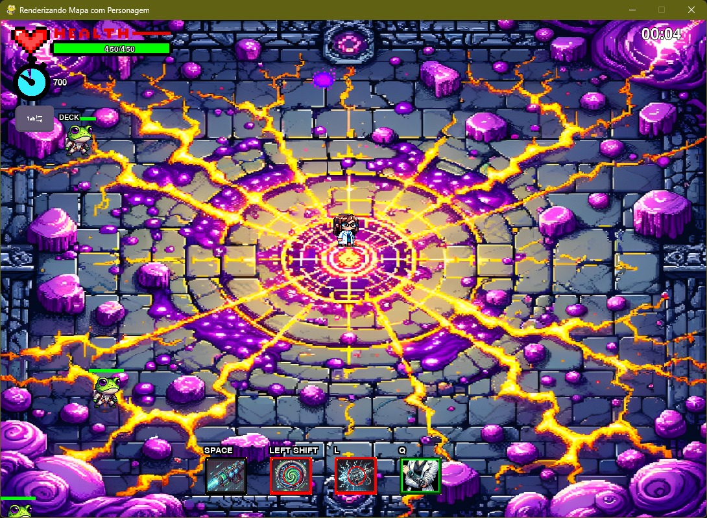

🚀 Ruptura Temporal

🎮 Um jogo open-source desenvolvido em Python com Pygame

📜 Sobre o Projeto

"Ruptura Temporal" é um jogo desenvolvido em Python usando a biblioteca Pygame. Este projeto foi construído não apenas como um jogo, mas como um aprendizado pessoal e comunitário. Minha jornada nesse projeto começou com a ideia de criar algo especial para a minha namorada, mas acabou se tornando algo maior do que eu poderia imaginar. Agora, o jogo está disponível para a comunidade open-source com o objetivo de contribuir para o aprendizado e diversão de todos.

Este projeto não é um jogo revolucionário nem tem um código perfeito e otimizado. Cada linha, cada fase e cada elemento foram criados como parte do meu aprendizado. É uma colcha de retalho — remendada e improvisada, mas que tem seu propósito e sentido únicos.

COMO INSTALAR O JOGO SEM OS ARQUIVOS .py (PARA QUEM NÂO É DEV):
[CLIQUE AQUI](https://github.com/HenryMelo23/Ruptura_Temporal/releases/tag/v0.0.1)

MENU :

  

🌊 Fase 1: A Praia em Ruínas

  

❄️ Fase 2: O Reino Gélido

  

🐀 Fase 3: A Dimensão dos Ratos Cultistas

  

🐸 Fase 4: O Mundo dos Sapos Cientistas

  

🔥 Fase 5: Em Desenvolvimento

A quinta e última fase ainda está em desenvolvimento. Esta será a fase final, onde o jogador enfrentará o boss derradeiro. No entanto, para garantir que a experiência seja equilibrada e divertida, lançamos o jogo antes de concluir esta fase para receber feedback da comunidade.

Temos percebido que muitos jogadores encontram dificuldades nas fases iniciais, especialmente na segunda fase. Por isso, antes de avançar para a conclusão do jogo, estamos focando em ajustes de dificuldade e balanceamento para melhorar a experiência geral.

🛠️ Tecnologias
Python — Linguagem principal.

Pygame — Framework usado para o desenvolvimento do jogo.

Imagens geradas por IA — Criadas com inteligência artificial e tratadas manualmente por mim.

🌐 Objetivo
O projeto tem o propósito de:

📘 Compartilhar conhecimento: Tornar o código aberto e acessível para que qualquer pessoa possa aprender junto comigo.

🎨 Criar algo único e pessoal: Transformar a ideia inicial em algo que todos possam aproveitar e modificar.

🕹️ Contribuir para a comunidade: Oferecer diversão e aprendizado para quem quiser entrar no mundo do desenvolvimento de jogos.

🔍 Como Contribuir

Caso deseje contribuir com o projeto "Ruptura Temporal", sinta-se livre para:

📝 Fazer fork e criar pull requests.

📢 Relatar bugs e sugerir melhorias.

🤝 Compartilhar ideias e aprender junto!

🔗 Licença

Este projeto está licenciado sob a Creative Commons Attribution-NonCommercial-ShareAlike 4.0.

Direitos e Restrições:

🚫 Uso Comercial Proibido: Não é permitido usar o projeto para fins comerciais sem autorização explícita.

🔄 Modificação e Redistribuição: Permite modificar e redistribuir o projeto, desde que atribua ao autor original e mantenha a mesma licença Creative Commons.

📜 Agradecimentos

Gostaria de agradecer a todos que acompanharam e apoiaram o desenvolvimento desse projeto. A ideia inicial era algo pessoal, mas graças ao apoio da comunidade, o projeto cresceu e se tornou algo maior. Espero que este projeto ajude a inspirar e ensinar aqueles que querem aprender a criar jogos e explorar o desenvolvimento em Python com o Pygame.

✨ Links e Contatos

- **Instagram:** [@henri_meelo](https://www.instagram.com/henri_meelo/)
  
- **YouTube:** [HMeloI](https://www.youtube.com/@HMeloI)

Seja você um desenvolvedor iniciante ou experiente, "Ruptura Temporal" é um projeto feito para todos. Aproveite, aprenda e contribua. Vamos crescer e evoluir juntos!

